# can收发说明
## 1.初始化
````
void CanBasic_init(void)
{
    canA_init(1000);
    can_mbox_set(0x20,0x10);    
}
````



## 2.收发任务
````
void CanApp_MainFunction(uint8_t quantity)
{
    /* step1: 刷新运行数据 */
    can_Tx_Buff_refresh(quantity);
    /* step2: 发送数据 */
    CanApp_Tx(quantity);
    /* step3: 接收数据 */
    CanApp_Rx(quantity);
    /* step4: 处理接收数据 */
    can_Rx_Buff_refresh(quantity);
}
````

## 3.错误计时
void can_err_timer(uint8_t quantity)
